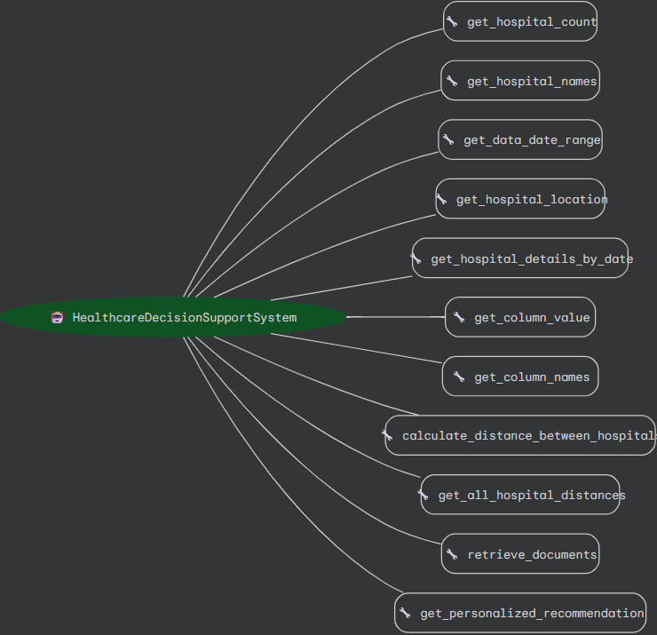

# Healthcare Decision Support System (Google ADK Implementation)

A sophisticated healthcare analytics and decision support system built on Google's Agent Development Kit (ADK). This implementation leverages a single powerful LLM agent with comprehensive tool integration for hospital data analysis, resource optimization, and preference-aware recommendations.


## Function Architecture
The system implements a comprehensive set of functions managed by a central HealthcareDecisionSupportSystem agent:




*Diagrams: Google ADK (Method 1) and CrewAI (Method 2)*

## System Architecture

```plaintext
Healthcare Decision Support System (ADK)
├── Web Layer (FastAPI)
│   ├── HTTP Endpoints
│   │   ├── /query - Main interaction endpoint
│   │   └── /static - Static file serving
│   └── CORS Middleware
│
├── Agent Layer
│   ├── Root Agent (LlmAgent)
│   │   ├── Model: GPT-4
│   │   └── In-Memory Session Service
│   │
│   └── Tool Integration
│       ├── Hospital Analysis Tools
│       │   ├── get_hospital_count()
│       │   ├── get_hospital_names()
│       │   ├── get_hospital_details_by_date()
│       │   ├── get_column_value()
│       │   └── get_column_names()
│       │
│       ├── Spatial Analysis Tools
│       │   ├── get_hospital_location()
│       │   ├── calculate_distance_between_hospitals()
│       │   └── get_all_hospital_distances()
│       │
│       └── Advanced Features
│           ├── rag_function()
│           └── get_personalized_recommendation()
│
├── Data Layer
│   ├── Hospital Data
│   │   └── hospital_trends.csv
│   │
│   └── Vector Store
│       └── MongoDB (RAG)
│
└── Static Content
    ├── HTML Interface
    ├── JavaScript
    └── CSS Styling
```

## Key Features

- **Multi-Agent Architecture**: Specialized agents for data ingestion, analysis, and decision support
- **Hospital Data Analysis**: Track 40+ metrics including beds, ICU, ventilators, staff, supplies
- **Distance Calculations**: Real-time distance calculations between hospitals using coordinates
- **Comprehensive Metrics**: Resources, staff, patient flow, supplies, equipment status
- **Data-Driven Insights**: Actionable recommendations based on actual hospital data

## Quick Start

### Prerequisites

- Python 3.13+
- Google API Key (for Gemini)
- OpenAI API Key (for embeddings)
- MongoDB Atlas account (for RAG - optional)

### Installation

1. Clone the repository:
```bash
git clone https://github.com/AbhishekC1005/Hospital-Management-AI-Agent.git
cd Hospital-Management-AI-Agent
```

2. Install dependencies:
```bash
pip install -r requirements.txt
```

3. Create `.env` file:
```env
GOOGLE_API_KEY=your_google_api_key
OPENAI_API_KEY=your_openai_api_key
MONGODB_URI=your_mongodb_uri
MONGODB_DATABASE=rag_database
MONGODB_COLLECTION=documents
MONGODB_VECTOR_INDEX=vector_index
```

4. Run the agent:
```bash
adk web .
```

Open http://localhost:8000 in your browser.

## Sample Data

The system includes sample data for 5 hospitals:
- City General Hospital (H001)
- Regional Medical Center (H002)
- Community Health Center (H003)
- Metropolitan Hospital (H004)
- District Hospital (H005)

Data covers 7 days (2024-10-20 to 2024-10-26) with comprehensive metrics.

## Example Queries

### Basic Information
```
"How many hospitals are there?"
"List all hospitals with their locations"
"What dates are available?"
```

### Detailed Analysis
```
"Show me details for City General Hospital on 2024-10-20"
"What is the bed occupancy for Regional Medical Center?"
"Calculate distance between City General Hospital and Metropolitan Hospital"
```

### Strategic Insights
```
"Recommend resource transfers between hospitals"
"What are the top priorities for today?"
"Show me hospitals with ventilator shortages"
```

## Architecture

The system uses a multi-agent architecture with three specialized agents:

1. **DataIngestionAgent**: Retrieves basic hospital information (counts, names, locations, date ranges)
2. **HospitalAnalyst**: Analyzes detailed metrics and calculates distances
3. **DecisionSupportAgent**: Provides strategic recommendations and insights

## Available Tools

### Hospital Data Tools
- `get_hospital_count()` - Total number of hospitals
- `get_hospital_names()` - List all hospitals with coordinates
- `get_hospital_details_by_date()` - Complete hospital snapshot
- `get_column_value()` - Specific metric values
- `get_column_names()` - Available data columns
- `get_hospital_location()` - Hospital coordinates
- `get_data_date_range()` - Available date range

### Distance Tools
- `calculate_distance_between_hospitals()` - Distance between two hospitals
- `get_all_hospital_distances()` - Distance matrix for all hospitals

## Project Structure

```
.
├── agent/
│   ├── agent.py                    # Main agent definition
│   ├── tools/
│   │   ├── hospital_data.py        # Data access layer
│   │   ├── hospital_functions.py   # Agent tool wrappers
│   │   └── rag_function.py         # RAG tool
│   └── data/
│       └── hospital_trends.csv     # Hospital data
├── scripts/
│   ├── create_vector_index_simple.py
│   └── add_documents.py
├── .env                            # Environment variables
├── requirements.txt                # Dependencies
└── README.md                       # This file
```

## Technology Stack

- **Agent Framework**: Google ADK (Agent Development Kit)
- **AI Model**: OpenAI GPT-4o-mini (via LiteLLM)
- **Embeddings**: OpenAI text-embedding-3-small
- **Vector Database**: MongoDB Atlas
- **Data Analysis**: Pandas
- **Language**: Python 3.13+

## Data Schema

Hospital data includes:
- **Resources**: Beds, ICU beds, ventilators, ambulances
- **Staff**: Doctors, nurses, paramedics (total, available, overtime, sick leave)
- **Patient Activity**: Admissions, discharges, emergency visits, surgeries, wait times
- **Supplies**: Masks, gloves, sanitizer, medicines
- **Equipment**: X-ray, CT scan, MRI functionality
- **Infectious Cases**: COVID, flu, other diseases
- **Metrics**: Burnout risk, patient satisfaction, transport costs
- **Location**: Coordinates for distance calculations

## Contributing

Contributions are welcome! Please feel free to submit a Pull Request.

## License

MIT License

## Acknowledgments

Built with [Google ADK](https://github.com/google/adk) and powered by OpenAI models.

---

**Note**: This is a demonstration system with sample data. For production use, integrate with real hospital data sources and implement appropriate security measures.
